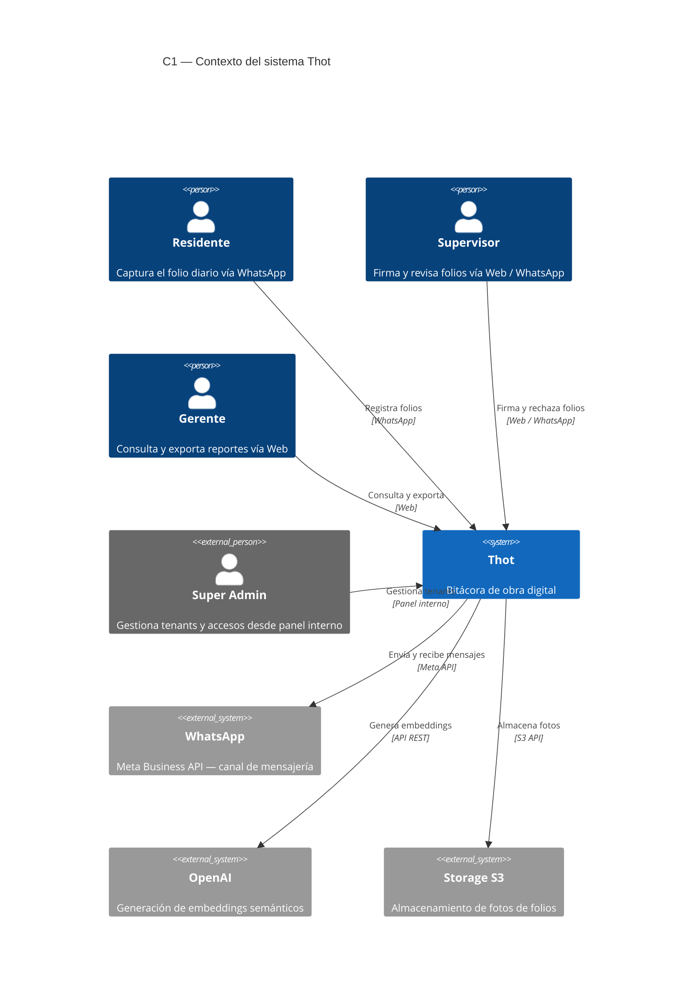
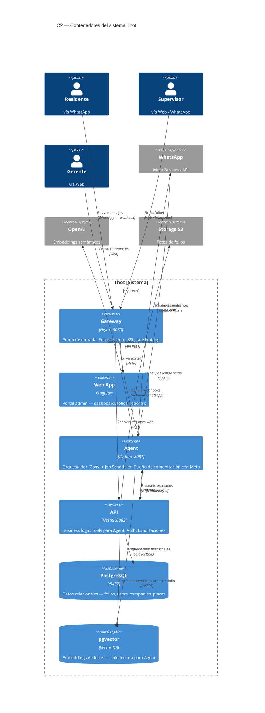

# Arquitectura C4

## C1 — Contexto del sistema

Muestra los actores que interactúan con Thot y los sistemas externos con los que se conecta.

> **Nota:** El C1 muestra el sistema Thot como una caja negra. Los detalles internos
> (Nginx, Agent, API, DB) se detallan en el C2.

## C2 — Contenedores del sistema

Abre la caja negra de Thot y muestra los contenedores internos con sus responsabilidades y conexiones.

> **Decisión clave:** PostgreSQL y pgvector son bases de datos separadas.
> El API es el único que escribe en ambas. El Agent solo lee de pgvector para búsquedas semánticas.

### Reglas de comunicación

| Regla | Descripción |
|---|---|
| Agent → Meta | El Agent es el **único** que habla con WhatsApp/Meta |
| API → PostgreSQL | El API es el **único** que accede a datos relacionales |
| API → pgvector | El API **escribe** embeddings cuando un folio cambia a `closed` |
| Agent → pgvector | El Agent **solo lee** de pgvector para búsquedas semánticas |
| API → S3 | El API es el **único** que toca el Storage de fotos |
| Agent → DB | El Agent **nunca** accede directo a PostgreSQL |