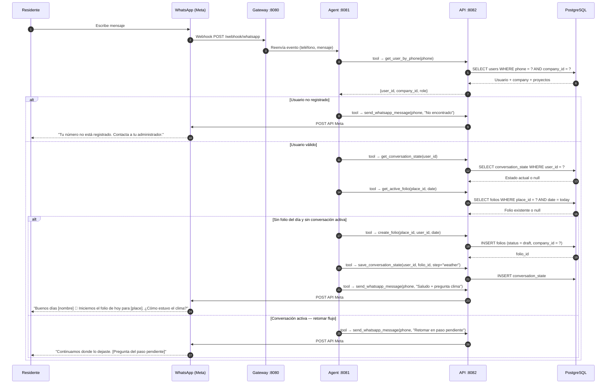
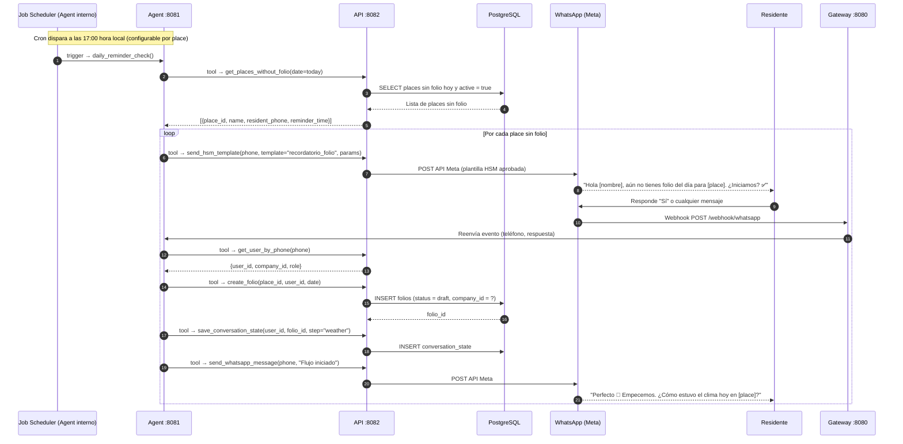
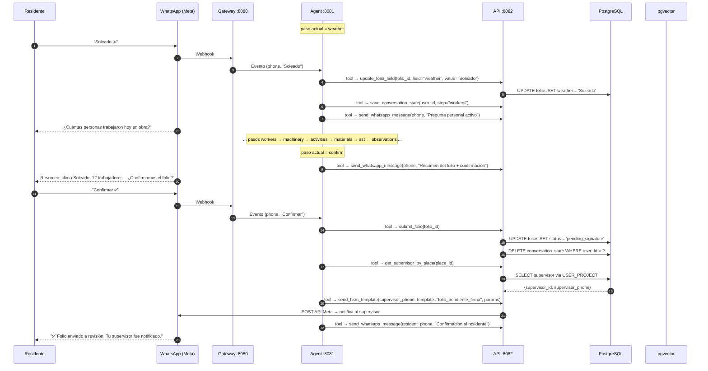
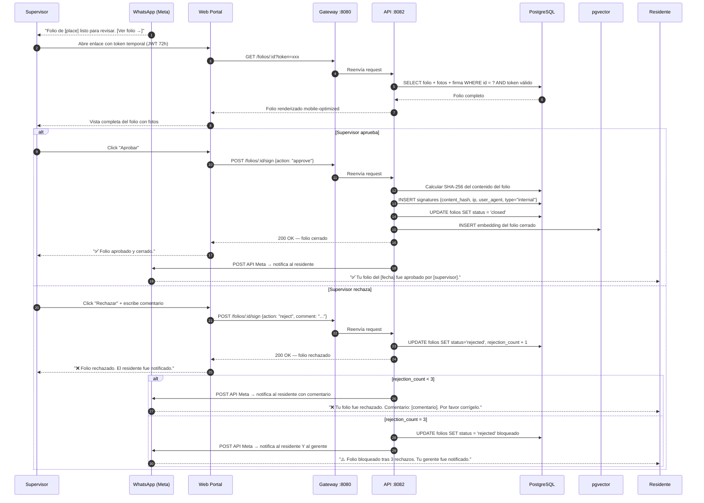
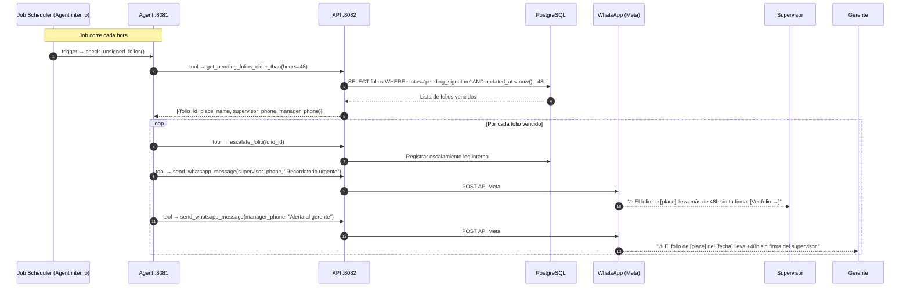
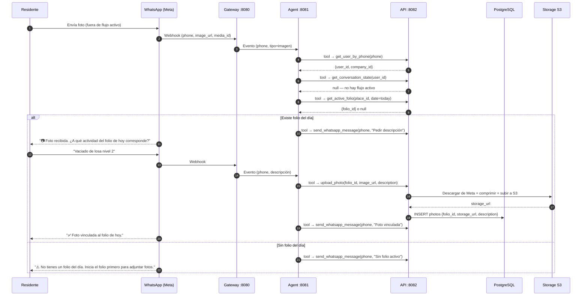
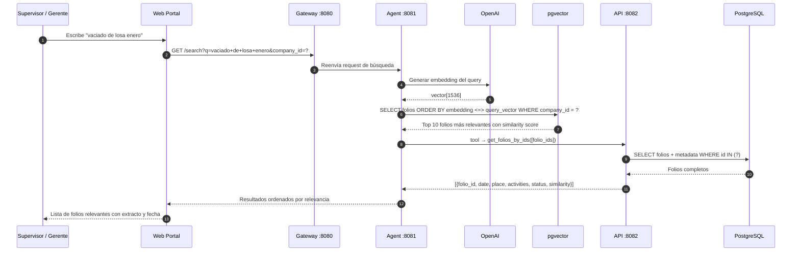

# Thot — Diagramas de Secuencia
**Versión:** 1.2
**Arquitectura:** Microservicios — Agent como orquestador

---

## Arquitectura de referencia

```
WhatsApp (Meta)  ←→  Gateway :8080  ←→  Agent :8081  ←→  API :8082  ←→  PostgreSQL :5432
Web Portal       ←→  Gateway :8080  ←→  API :8082    ←→  PostgreSQL :5432
Agent            ←→  pgvector       (solo lectura — búsqueda semántica)
API              →   pgvector       (escritura de embeddings al cerrar folio)
Job Scheduler    →   Agent :8081    (interno — cron de recordatorios y escalamientos)
```

### Responsabilidades por microservicio

| Servicio | Puerto | Responsabilidad |
|---|---|---|
| **Gateway** | 8080 | Punto de entrada único. Enrutamiento, SSL, rate limiting |
| **Agent** | 8081 | Orquestador de conversaciones. Decide el flujo, invoca tools del API. Dueño de comunicación con Meta. Job Scheduler interno |
| **API** | 8082 | Tools del agente + endpoints del portal web. CRUD, business logic, exportaciones, auth |
| **PostgreSQL** | 5432 | Datos relacionales. Acceso exclusivo desde API |
| **pgvector** | — | Embeddings de folios. API escribe, Agent lee para búsqueda semántica |

### Tools que Agent invoca del API

| Tool | Descripción |
|---|---|
| `get_user_by_phone` | Busca usuario por número de WhatsApp |
| `get_conversation_state` | Recupera estado de conversación activo del usuario |
| `get_active_folio` | Verifica si existe folio del día para un place |
| `create_folio` | Crea un nuevo folio en estado `draft` |
| `save_conversation_state` | Persiste el paso actual y contexto parcial |
| `update_folio_field` | Actualiza un campo del folio con la respuesta del residente |
| `submit_folio` | Cambia estado a `pending_signature` y dispara notificación |
| `get_supervisor_by_place` | Obtiene supervisor asignado al place |
| `send_whatsapp_message` | Envía mensaje de texto libre (ventana de 24h activa) |
| `send_hsm_template` | Envía plantilla aprobada por Meta (inicio de conversación) |
| `upload_photo` | Comprime y sube foto a storage S3-compatible |
| `get_places_without_folio` | Lista places activos sin folio del día (para recordatorio) |
| `sign_folio` | Registra firma, genera embedding y cambia estado a `closed` |
| `reject_folio` | Incrementa `rejection_count`, cambia estado a `rejected` |
| `escalate_folio` | Notifica al gerente por folio sin firma > 48h |

---

## Flujo A — Residente inicia espontáneamente

El residente escribe al bot en cualquier momento del día sin haber recibido recordatorio.



---

## Flujo B — Recordatorio automático → residente responde

El job scheduler interno del Agent detecta a las 17:00 que un place no tiene folio del día.



---

## Flujo C — Llenado del folio (flujo conversacional completo)

Aplica tanto para Flujo A como B una vez iniciado el folio.



---

## Flujo D — Firma del supervisor (aprobación o rechazo)

El supervisor accede al portal web desde el enlace recibido por WhatsApp.



---

## Flujo E — Escalamiento por firma tardía

Job interno del Agent que corre cada hora y detecta folios sin firma > 48h.



---

## Flujo F — Adjuntar foto fuera del flujo conversacional

El residente envía una foto por WhatsApp cuando no tiene un flujo activo.



---

## Flujo G — Búsqueda semántica

El supervisor o gerente busca en el historial de folios usando lenguaje natural.



---

## Notas de implementación

### Plantillas HSM requeridas

| Template | Flujo | Uso |
|---|---|---|
| `recordatorio_folio` | Flujo B | Recordatorio diario sin folio |
| `folio_pendiente_firma` | Flujo C | Notificación al supervisor |
| `folio_escalado` | Flujo E | Escalamiento al gerente |

### Ventana de 24h de WhatsApp
Una vez que el residente o supervisor responde un HSM, el bot puede enviar mensajes de texto libre durante 24h. Si la ventana expira, el próximo mensaje debe ser otro HSM. El Agent rastrea `last_interaction` en `CONVERSATION_STATE`.

### Token temporal del supervisor (Flujo D)
JWT de corta duración (72h) vinculado a `folio_id` + `user_id`. No requiere login completo para el MVP.

### Embedding de folios (Flujo D → pgvector)
El embedding se genera y persiste **solo cuando el folio se cierra** (`status = closed`). El API genera el texto concatenado del folio, llama a OpenAI, y hace INSERT en pgvector con `company_id` como metadata para aislamiento multi-tenant.

### Aislamiento multi-tenant en búsqueda semántica
Toda query a pgvector incluye filtro `company_id` — el Agent nunca retorna resultados de otra company aunque los vectores sean similares.

### Acceso a bases de datos

| Servicio | PostgreSQL | pgvector |
|---|---|---|
| Gateway | ❌ | ❌ |
| Agent | ❌ | ✅ Solo lectura |
| API | ✅ CRUD completo | ✅ Solo escritura |
